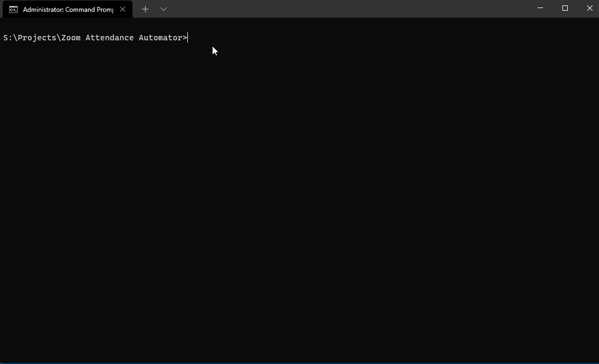

 


# Python Regex

- Regex automates the task of saving and calculating, how many participants attended your zoom meeting
- I build this project for my college, as my college uses zoom for academic purposes and taking lectures and practicals
- I acknowledged that the task of taking and storing attendance is repetitive and boring
- To solve this task i created this project to save and store daily attendance for record keeping and storing data.

<hr>

## Installation

<hr>
Install python with windows package manager

```bash
winget install -e --id Python.Python
```

or go to https://www.python.org and download suitable version of python

- clone this repository into your pc

```bash
git clone https://github.com/Sayyed-Salman/Zoom-Attendance-Automator.git
```

- run attendance_automator.py from cmd

```bash
python attendance_automator.py
```

<hr>

## How it works

- It is really easy to use this script
- Open Command Prompt
- Run attendance_automator.py file

```
python attendance_automator.py
```

- if you downloaded this repository, i added a sample test data to test run this script, you can use that to see how it works

```
test_data.txt
```

- To get proper output with 100% accuracy either the name of the student or the attendance message they send should be in proper format as follows
- SYCS-99-Your Name
- If the names of the students is not in correct format, their attendance would not be recorded by this script.



<hr>
